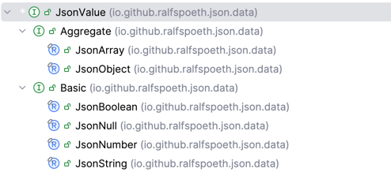

# Java JSON IO Library

This project implements a JSON parser and serializer 
which operates around immutable data structures for 
the JSON elements, that is: text to JSON and JSON to text.

The library contains some standard query functions
which are to be used to transform JSON elements
into objects of arbitrary classes.

## Motivation

Having read a number of articles around data oriented
programming (cf. [Brian Goetz, Data-Oriented Programming](
https://www.infoq.com/articles/data-oriented-programming-java/), 
note the section "Example: JSON" in particular)
where the JSON format has been of special interest,
and being quite dissatisfied with the usage experience
of popular JSON libraries like [GSON](https://github.com/google/gson)
or [Jackson](https://github.com/FasterXML/jackson)
the motivation to implement an alternative library was high enough
to start the project.

The JSON type hierarchy is very simple and strict
enough to apply the algebraic data types introduced
through `sealed` classes and interfaces (union types)
and `record`s (product types)
efficiently. These ideas struck with me, so I
started to look around for a parser which 
returns an immutable `JsonElement` from a stream
of characters. 

I then found [JEP 198: Light-Weight JSON API](https://bugs.openjdk.org/browse/JDK-8046390)
which names immutable data types and a builder-style 
API as part if its goals. The immutable type hierarchy,
the builder-style API plus the implicitly required
parser which returns immutable instances of the JSON
type hierarchy finally lead to this experiment.

Learning a tiny little bit of 
[Clojure](https://clojure.org/about/rationale)
taught me another series of important things,
the most striking being Rich Hickey's keynote about
[The Value of Values](https://www.youtube.com/watch?v=-6BsiVyC1kM)
at the Jaxconf 2012 in San Francisco.
Treating values as immutable data changes the mental
model of programming at least if you're coming 
from the object-oriented world.

Yet reading a potentially large file of JSON text
and returning a single immutable instance of some
type is an interesting tasks which requires some 
intermediate mutable objects hopefully hidden beneath
the facade of the parser. We finally managed to use 
mutable builders throughout the parsing phase and
to return immutable instances in the end.

## Current Status

The current version 1.1.34 is mature and stable and
will not be changed with respect to the hierarchy of classes
and interfaces in package `io.github.ralfspoeth.json` and
the parser implemented through `JsonReader` in package
`io.github.ralfspoeth.json.io`; the `JsonWriter` serializer
class in the same package has not been battle-tested thus far 
but satisfies our needs.

Beginning with version 1.1.25 we've added a number of tests
from the nst [JSON Test Suite](https://github.com/nst/JSONTestSuite) 
which revealed some issues 
parsing especially non-well-formed JSON documents; current progress
improves upon the current stability. The API surface, however, doesn't change.

The `Path` and `Queries` classes in package
`io.github.ralfspoeth.json.query` are still in development
yet prove to be useful.

The `JsonReader` interface now implements `Iterator` such that
it allows reading streams of elements.

## Getting Started

### Importing The Library

Maven Coordinates

    Group ID: io.github.ralfspoeth
    Artifact ID: json

In your `pom.xml` add

    <dependency>
        <groupId>io.github.ralfspoeth</groupId>
        <artifactId>json</artifactId>
        <version>1.1.34</version>
    </dependency>

or, when using Gradle (Groovy)

    implementation 'io.github.ralfspoeth:json:1.1.34'

or, with Gradle (Kotlin), put 

    implementation("io.github.ralfspoeth:json:1.1.34")

in your build file.

If you are using JPMS modules with a `module-info.java` file, add
    
    module your.module {
        requires io.github.ralfspoeth.json;
        // more
    }

### Basic Usage

The module `io.github.ralfspoeth.json` exports three packages that you 
may use in your application:

    import io.github.ralfspoeth.json.*;       // class hierarchy
    import io.github.ralfspoeth.json.io.*;    // reader and writer
    import io.github.ralfspoeth.json.query.*; // Queries and Path API

The first package contains the data types (`Element` and its descendants)
and the second contains the `JsonReader` and `JsonWriter` classes.
The last package contain the `Queries` class with static 
query functions and the `Path` API, both of which are under active 
development.

In your code you'll typically write something like this 
when your want to start with 

    Reader r = ...;
    try(var rdr = new JsonReader(r)) { // auto-closeable
        Element elem = rdr.readElement(); 
        // switch over elem
        double dbl = switch(elem) {
            case JsonNumber(double d) -> d;
            null, default -> throw new IllegalArgumentException("...");
        }

        // often, you may easily convert the element into a simple record
        // {"x": 1, "y": 2}
        record MyRecord(int x, int y) {} 
        var rcd =  new MyRecord(
            intValue(members(elem).get("x")), 
            intValue(members(elem).get("y"))
        );
        
        // or you may want to query some leaves in the JSON structure 
        Path.of("[1..3]/a/#x.*y/c").apply(elem).forEach(...);
    }

Writing data into a JSON stream works either through the builders

    Writer out = ...;
    JsonObject jo = Aggregate.objectBuilder()
        .named("x", JsonBoolean.TRUE)
        .named("y", new JsonNumber(5d))
        .build();
    try(var w = JsonWriter.createDefaultWriter(out)) {
        w.write(jo);
    }

or through standard conversions from an object of a `Record` subclass

    Writer out = ...;
    record Rec(boolean x, double y) {}
    Rec r = new Rec(true, 5d);
    Element jo = Element.of(r);
    try(var w = JsonWriter.createDefaultWriter(out)) {
        w.write(jo); // {"x": true, "y": "5.0"}
    }

The entire API is designed such that it never returns
`null` as an `Element` reference, but is, however, resilient
towards `null` as an argument wherever reasonable.

## JSON

[RFC 7159](https://datatracker.ietf.org/doc/html/rfc7159)
specifies the JSON data interchange format which 
has become the _lingua franca_ for RESTful webservices.
JSON serializes structured data in a human-readable 
text format. It supports four primitive types
(strings, `double` numbers, booleans and `null`) and 
two aggregates types (arrays of primitive or aggregate types
and objects which are basically
maps of names (strings) and values of primitive or aggregate types).

### Example:

    [{
        "name": "Gaius",
        "age": 41,
        "pro": false,
        "publications": ["De bello gallico"],
        "
    }, {
        "name": "Cicero",
        "senator": true,
        "children": null
    }]

This text represents an array of two objects; the
outer form reads `[a, b]` where `a` and `b` are the 
objects.
Braces `{` and `}` enclose these two objects
with name-value-pairs separated by commas, like 
`{ nvp1, nvp2, ...}`. 
Each name-value-pair consists of a name of type
string and a value of any other data type mentioned
above. The name-value-pairs make the properties or 
attributes of an object.
The `name` property of the first object is associated
with the string `"Gaius"`, the `pro` attribute 
with the value `false`. The value of the `publications`
attribute is an array of a single string valued
`"De bello gallico"`.

Wikipedia has more on JSON [here](https://en.wikipedia.org/wiki/JSON).

JSON is schema-less, that is, you cannot prescribe the structure
of a JSON document using some kind of schema.
This sets JSON apart from [XML](https://www.w3.org/TR/xml/) which
allows for the specification of document type definitions
([DTDs](https://www.w3.org/TR/xml/#sec-prolog-dtd)) 
or XML schema definitions 
([XSD](https://www.w3.org/TR/xmlschema/)).
XML, once hyped as the next big thing and with numerous 
applications still widely in use, has been surpassed by JSON 
according to
[Google Trends: JSON vs. XML](https://trends.google.de/trends/explore?date=all&q=XML,JSON&hl=EN)

### Remarks

The objects do not expose some notation of a type
or class. Two objects are considered equal if their 
attributes are equal. Arrays may contain any combination
of instances, including both primitive and structured 
types as in `[null, true, false, 1, {"x":5}, [2, 3, 4]]`

# Modelling the data in Java

## First Attempt

The first attempt can be easily copied from 
the sources cited above. Let's define a sealed 
interface

    package json;
    sealed interface Element permits ...;

and provide implementations very much like

    package json;
    final class Boolean implements Element{...}
    final class Number implements Element{...}
    final class Null implements Element{...}
    final class String implements Element{...}
    final class Array implements Element{...}
    final class Object implements Element{...}

The problem is that while possible almost
all the names collide with class names in the 
core package `java.lang`; once we consider modelling
the `String` class as `record` with single
component of class `java.lang.String` things 
start to get clumsy. We therefore decided to 
prefix the class names with `Json` or `JSON`. 

While `JSON` is clearly closer to the JSON specification,
it's more difficult to read than `Json`; since
following the spec was not so much a goal as 
the ease of use we decided to go with `Json` instead 
of `JSON` as the prefix for the concrete types; we left
the `Element` interface unchanged.

At the top of the hierarchy we then had

    public sealed interface Element {}

All implementations must be `final` or `non-sealed`
in order to comply with the contract for sealed
interfaces; since we don't design for further 
inheritance we will implement `final` classes only.

## Modelling `Boolean` as Enum

The two only instance of type `Boolean` are `true` and 
`false` in JSON notation; we model them as an enum
because it is implicitly final and the behaviour
of its `equals` and `hashCode` methods comes without
any surprises.

    public enum JsonBoolean implements Element {
        TRUE, FALSE
    }

## Modelling `null` as Singleton

As with booleans we decided to implement the `null`
as a singleton class.
The singleton pattern goes like 

    final class Singleton {
        static final Singleton INSTANCE = new Singleton();
        private Singleton(){}
    }

and translates into

    public final class JsonNull implements Element {
        private JsonNull() {} // prevent instantiation
        public static final JsonNull INSTANCE = new JsonNull(); 
    }

## Modelling `String` as Record of String

There is strictly speaking no need to wrap JSON strings into 
records with a single component of type string.
But in order to make JSON strings part of the sealed
hierarchy we have to do so:

    public record JsonString(String value) implements Element {}

This comes in handy once we deal with aggregate
types like arrays of `Element` rather than 
arrays of `Element` &bigcup; `String` which we 
cannot express in Java.

## Modelling `Number` as Record of `double`

With the same reasoning we model numbers like this:

    public record JsonNumber(double value) implements Element {}

Note that JavaScript doesn't cater for differences
between numerical data types &ndash; which is enormously
limiting &ndash; and that we use the primitive Java type
because `null` values are invalid.

## Modelling `Array` as Record of an Immutable `List`

As with strings we need to wrap the array in some
container - a final class or a record - plus
we want to make sure the contents is immutable:

    public record JsonArray(List<Element> elements) implements Element {
        public JsonArray {
            elements = List.copyOf(elements); // defensive copy
        }
    }

The canonical constructor is overridden such that 
it uses a copy of the list provided; 
that method is clever enough _not_ to copy the list
parameter if it can be sure that that parameter
is already an immutable instance &ndash; most notably if 
it has been instantiated using `List.of(...)`.
This method also makes sure no actual `null` instance
is passed in within the list of elements.
(`JsonNull`s are acceptable of course.)

## Modelling `Object` as Record of an Immutable `Map`

The same is true for `JsonObject`s. We model the properties 
or attributes or members as a map of `String`s (not `JsonString`s since
this wouldn't add any value and is much easier to use by clients) 
to `Element`s:

    public record JsonObject(Map<String, Element> members) implements Element {
        public JsonObject {
            members = Map.copyOf(members); // defensive copy
        }
    }

`Map.copyOf` provides a copy but returns the original map
when that is already immutable, especially when instantiated using
`Map.of(...)`.

Since both aggregate types `JsonObject` and `JsonArray` are 
shallowly immutable (or unmodifiable) and all basic types  
are immutable, the aggregate types are effectively immutable as well.
This makes instance of the entire hierarchy immutable.

## Differentiating between Aggregate and Basic Types

In lieu with the JSON specification which differentiates
between primitive and structured types, we differentiate
between basic and aggregate types like so:

    public sealed interface Element permits Basic, Aggregate {...}
    public sealed interface Basic extends Element permits
        JsonBoolean, JsonNull, JsonNumber, JsonString {}
    public sealed interace Aggregate extends Element permits
        JsonArray, JsonObject {...}

Naming primitive types basic and structured types aggregates has 
been a deliberate decision since the term primitive collides with
the notion of primitive types in the Java language.

## Aggregates are Functions

Both aggregate types serve as functions: `JsonObject`s are 
functions of `String`s and `JsonArray`s are functions of
an `int` index:

    Map<String, Element> members; // given
    var obj = new JsonObject(members);
    Function<String, Element> fun = obj; // legal
    
    List<Element> lst; // given
    var arr = new JsonArray(lst);
    IntFunction<Element> ifun = arr; // legal

That said, the hierarchy of the data classes is this:

# Builders

The [Builder pattern](https://en.wikipedia.org/wiki/Builder_pattern)
allows for a piecemeal construction of
immutable data and works like this:

    var immutable = new Builder(...).add(...).add(...).build();

It does not make much sense to provide builders for the basic data
types; yet very much so for the aggregate types.
This is another reason why we introduced the distinction between the two.

The `Builder` interface has been implemented as an inner interface
class of the `Aggregate` interface with two implementations:

    public sealed interface Aggregate permits JsonArray, JsonObject {
        sealed interface Builder<T extends Aggregate> {
            T build();
            // ...
        }
        final class ArrayBuilder implements Builder<JsonArray>{...}
        final class ObjectBuilder implements Builder<JsonObject>{...}
        // ...
    }

Since the implementing classes reside within the same compilation unit
as the `Builder` there is no need for the `permits` clause.

## ArrayBuilder

The array builder simply provides a method that adds an `Element`:

    final class ArrayBuilder implements Builder<JsonArray> {
        item(Element e) {
            // add to mutable list
        }
        JsonArray build() {
            return new JsonArray(List.of(mutableList));
        }
    }

## ObjectBuilder

The object builder is not so different:

    final class ObjectBuilder implements Builder<JsonObject> {
        named(String name, Element e) {
            // put into mutable map
        }
        JsonObject build() {
            return new JsonObject(Map.of(mutableMap));
        }
    }

Both builders are instantiable through static methods in the 
`Element` interface exclusively:

    JsonObjectBuilder objectBuilder();
    JsonArrayBuilder arrayBuilder();

The implementing classes both need to be public because they provide
different methods for adding intermediate data;
`JsonArray` provides an `item(Element)` method and
`JsonObject` a `named(String, Element)` method in order to
add data their internal structures.

# IO: Reading and Writing JSON Data

## JsonReader

The parser implementation named `JsonReader` in package
`io.github.ralfspoeth.json.io` implements the `AutoCloseable` interface and is
meant to be used in try-with-resources statements like so:

    Reader src = ...
    try(var rdr = new JsonReader(src)) {
        return rdr.readElement();
    }

It uses a `Lexer` internally which tokenizes a character stream
into tokens like braces, brackets, comma, colon, number literals, 
string literals, and `null`, `true`, and `false`.
The parser uses a stack of nodes which encapsulate builders, special tokens, or an element. 
It utilizes an inner sealed interface to cater for this limited set of stack elements.

## JsonWriter

The `JsonWriter` class is instantiated with its 
default behaviour of indenting the members of JSON 
objects by 4 characters and putting each member in 
a separate line. Arrays are printed interspersed 
by commas and a white space but in a single line.

The usage is similar to that of the `JsonReader` with
the exception that it uses a single factory method currently
but not constructor:

    Element object = ... 
    Writer w = ... 
    try(var wrt = JsonWriter.createDefaultWriter(w)){
        wrt.write(object);
    }

The `JsonWriter` provides the static method
`minimize` which removes whitespace safely from 
a given input stream.

# Querying Data

The package `query` provides simple utilities
for querying data based on some root element.

## The `Path` Utility

The `Path` class is inspired by the [XPath](https://www.w3.org/TR/xpath/)
specification yet lacks almost all of its features;
it's currently just a toy.

### Basic Usage

A `Path` instance is instantiated using the factory
method `Path::of` like so:

    var path = Path.of("a/b/c");

The path expression is split using the `/` character.
Given the statement above, we obtain the equivalent of

    var path = Path.of("c", Path.of("b", Path.of("a")));

where the second parameter is the parent path.
We then use `Path::evaluate` which returns a stream
of `Element`s. Consider this root object `root`

    {
        "a": {
            "b": {
                "c": true
            }
        }
    }

then
    
    assert JsonBoolean.TRUE==path.evaluate(root).findFirst().get();

will not throw an `AssertionError`.

### Syntax

The syntax for the patterns is
* `a..b` where `a` and `b` are integers; a range pattern applicable to arrays;
* `#regex` where `regex` is a regular expression filtering attributes of objects;
* `name` where `name` is just the member name of the root object.

### Examples

Given `[2, 3, 5, 7, 11]` then `Path.of("0..2")` yields
the stream of the first two array elements `2` and `3`.

Given `{"a0":true,"a1":false}` then `Path.of("#a.")`
yields the stream of `true` and `false`.

Given `{"a":{"b":5}}` then `Path.of("a/b")` yields 
the stream of `5d`.

## The `Queries`

The package `io.github.ralfspoeth.json.query` 
contains the utility class `Queries`
which converts `Element`s into primitive types `int`, `long`, `double` or 
`boolean` and to `String` or a given `Enum` type.

All functions take any `Element` type as an argument and may
throw `IllegalArgumentException` for the sake of simplicity.
The functions respects 
that many JSON authors put all values into double-quotes, even `null`, `true`, and `false`
as well as numbers. These values are parsed into `JsonString` instance;
their contains is converted into numbers, boolean values and `null` if possible 
as well.

## Take the Clutter Away

The JSON structure _done right_ as we think gives us the basis for further processing data
utilizing the pattern matching features of Java. However, there are still situations
where a JSON structure is replicated with each element mapped onto its natural counterpart,
that is

* `null` to `null`s,
* `true` and `false` to `boolean`s,
* `JsonDouble` to `double`s,
* `JsonString` to `String`s,
* `JsonObject` to immutable `Map<String, ?>`s, and 
* `JsonArray` to immutable `List<?>`s.

So, a nested JSON structure like

    {"a": null, "b": true, "c": {
        "x": [1, 2, null, true], "y": false, "z": null
    }}

is converted by `Queries.value` into 

    Map.of( // "a" to null binding is cut out, cf. Map#of
        "b", Boolean.TRUE, // note the primitive wrapper
        "c", Map.of(
            "x", List.of(1, 2, true), // null element is cut out 
            "y", Boolean.FALSE // "z" to null binding is left out
        )
    )

Things to note: maps and lists accept `null` values in principle,
yet the factory methods `List.of` and `Map.of` do not accept `null` values
or `null` bindings; so, `JsonNull` instances are filtered out of aggregates.
That said, always consider the maps and lists regardless of the depth of the structure immutable.

### Numerical Conversions

The methods `intValue`, `longValue` and `doubleValue` utilize the 
`parse<Type>` methods of the respective `Integer`, `Long` and `Double` 
classes for `JsonString`s, and standard conversion from `double` to `int` and `long`
for `JsonNumber`s. `JsonBoolean` are converted to 1 and 0 for `TRUE` and `FALSE`, 
respectively.

These functions are provided with and without a default value as their second parameter.
`intValue(Element elem, int def)` accepts `null` elements and return the `def`ault instead;
the method fails with `IllegalArgumentException` for `Aggregate`s. The companion methods work likewise.

There is no direct support for `byte`, `char`, `short` and `float` 
which is very much in line with the choices of Java's functions and stream design.

### String Conversion

The `stringValue` conversion uses natural conversions for all
`Basic` types, and the `toString` methods applied on the contained 
`list`s and `map`s of the `Aggregate` types.

### Boolean Conversion

The `booleanValue` conversion does the obvious conversions for `JsonBoolean`
and `JsonString`.

### Enum Conversion

The `enumValue...` methods takes two arguments: a class declared with the `enum` 
keyword, and the `Element` which must be of type `JsonString`. 
While `enumValue` uses the `Enum::valueOf` method, the `enumValueIgnoreCase`
converts the value and all the constants' names defined in the enum class 
to uppercase strings before selecting the enum constant.

### JsonArray to Primitive Array

A `JsonArray` can be converted into an array of primitives; 
all elements are converted using `Queries.{int|long|double|...}Array(Element)`.

# Usage in Clojure

Clojure uses maps to aggregate data and prefers keywords as keys in these maps.
Here is a link to a video from Rich Hickey:
[Just use maps](https://youtu.be/aSEQfqNYNAc?si=tkFy1CMS8fWN7bP-)

In order to use this Java library, include this in your `deps.edn` file:

    {:deps {
        io.github.ralfspoeth/json {:mvn/version "1.1.34"}
        }}

Import the `Element` and IO classes into your namespace like this

    (ns your.name.space
        (:import 
            (io.github.ralfspoeth.json Element Basic JsonNull JsonArray JsonObject)
            (java.io Reader)
            (io.github.ralfspoeth.json.io JsonReader))
        (:require [clojure.java.io :as io]))

Use this function in order to read JSON data from some
`java.io.Reader`

    (defn read-elem [^Reader rdr]
        (with-open [jsrd (JsonReader. rdr)]
        (.readElement jsrd)))

and then, in order to turn the resulting `Element` into
a clojure map

    (defn map-json ([^Element elem]
        (cond
          (instance? JsonNull elem) nil,
          (instance? Basic elem) (.value elem)
          (instance? JsonArray elem) (mapv map-json (.elements elem))
          (instance? JsonObject elem) (zipmap
                                        (map keyword (->> elem (.members) (.keySet))),
                                        (map map-json (->> elem (.members) (.values)))))))

