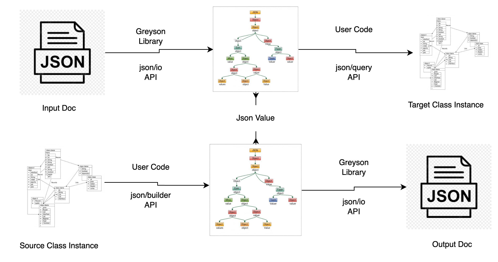
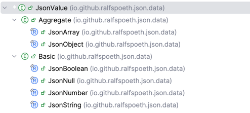

# Greyson - Java JSON IO Library

A modern Java library for parsing JSON into **immutable data structures** 
and serializing them back to text. It features a robust parser, a fluent builder API, 
efficient UTF-8 serialization, and powerful query functions to transform JSON 
elements into any Java objects.


## Goals

*   **Immutable JSON Representation**: Work with JSON data that cannot change after creation, ensuring thread safety and predictable state.
*   **Robust Parsing**: Reliably parse all legal JSON documents and streams.
*   **Fluent Builder API**: Construct complex JSON objects and arrays with ease.
*   **Efficient Serialization**: Quickly serialize JSON elements into UTF-8 documents and streams.

Greyson parses the original version of JSON only with the relaxation
that ALL values may be root elements, not just objects and arrays. There are 
no options to customize the contents, to be more relaxed or even stricter at the 
parsing level.

## Current Status

We are heading towards release 1.2. and are going into the beta phase.
The public API is stable, some tests plus some JavaDoc comments
are still to be added.

### Changes

The current version of the library is 1.2.0.
It contains breaking changes compared to version 1.1.x:
* The common interface has been renamed from `Element` to `JsonValue`
  because that naming pattern seems to be more in line with other libraries.
* The package `io.github.ralfspoeth.json.data` has been added and contains
  these data carrier classes.
* `JsonNumber` uses `BigDecimal` instead of `double` for its payload.
* `JsonBoolean` and `JsonNull` are implemented as `record`s, no longer as an `enum` or 
  singleton, respectively.
* The new `Greyson` class has been added to simplify reading and writing JSON data.
* The `JsonReader` and `JsonWriter` support reading resp. writing `Builder` instances
  in addition to `JsonValue`s.
* Conversions from and to `record`s have been removed in an attempt to get rid of deep
  reflection.
* It utilizes `JSpecify` nullness annotations.

### Builder API changes

Beginning with version 1.2.0, the `Builder`s are the mutable duals of
their immutable `JsonValue` counterparts, such that
```java
    var jo = new JsonObject(...);
    var builder = Builder.objectBuilder(jo);
    assert jo.equals(builder.build());
```
and most naturally 
```java
    var ja = new JsonArray(...);
    var builder = Builder.arrayBuilder(ja);
    assert ja.equals(builder.build());
```
plus 
```java
    var jv = Basic.of(...);
    var builder = Builder.basicBuilder(jv);
    assert jv.equals(builder.build());
```
or simply
```java
    JsonValue value; // given
    assert value.equals(Builder.of(value).build());
```
The conversions from `JsonValue` to `Builder` are recursive in both directions.
A `JsonArray` of `JsonObject`s is turned into a `JsonArrayBuilder` 
with mutable `JsonObjectBuilder` instances in its mutable `ArrayList` data collection.
The `build` method turns it into a fresh, immutable `JsonArray` instance
of `JsonObject`s.

## The Greyson Workflow

The Greyson workflow has been designed around the JSON in-memory object representation
described below:

* The Greyson library parses a JSON document into a `JsonValue` instance.
* User code uses the _Greyson Query API_ to instantiate target class instances
  for this value.
* User code transforms an arbitrary class instance 
  (or array or collection of objects) into a `JsonValue`
  using the _Greyson Builder API_.
* The Greyson library serializes this `JsonValue` into a JSON file.



## Why Yet Another JSON Library?

There is nothing wrong with either Jackson or GSON. Both
Jackson and GSON tend to provide some magic twists to convert
a JSON document into an arbitrary class instance and vice versa.
Both libraries support a model similar to the Greyson workflow with
an intermediate representation, and both libraries provide access to 
their token stream parsers. Both provide extensive customization options.
All these features make these libraries quite large. Greyson is intentionally
small both in terms of package size and in terms of classes, methods and more
important: conceptual design.

Greyson is not intended to be the fastest JSON parsing library on the planet...
nor is it. Micro benchmarks and profiling tests show that 
both parsing and writing using Greyson is slower than
GSON or Jackson in its current incarnation. These two libraries
use a lot of (sometimes dirty and ugly) tricks to gain maximum performance.
The Greyson library, however,
uses algebraic data types even for the internal intermediate representation
of the parsed data, which leads to a very clean lexer and parser as well as
writer designs -- yet at the expense of performance.
We assume that value classes will help Greyson to close the gap to GSON and Jackson
in the future without compromising the current simplicity of the implementation.

The Greyson library is really tiny: together with its dependencies on 
`jspecify` nullness annotations (4kB) and my very own `basix` package (<20kB) it's less than 100kB.
Google's GSON packages including dependencies are as large as about 300kB, 
which is three times the size.
Jackson's core library weighs about 600kB, the `databind` package about 1.7MB,
which is about 2.3 MB altogether or about 23 times
the size of the Greyson package.

## JSON Test Suite

Beginning with version 1.1.25, we've added a number of tests
from the **nst** [JSON Test Suite](https://github.com/nst/JSONTestSuite). 
This test suite revealed some minor and even larger issues 
parsing especially non-well-formed JSON documents, which have been fixed 
in the 1.1.x branches as well as in the current 1.2 branch.

## Getting Started

### Importing The Library

Maven Coordinates

    Group ID: io.github.ralfspoeth
    Artifact ID: json

In your `pom.xml` add
```xml
    <dependency>
        <groupId>io.github.ralfspoeth</groupId>
        <artifactId>json</artifactId>
        <version>1.2.0</version>
    </dependency>
```
or, when using Gradle (Groovy)
```groovy 
    implementation 'io.github.ralfspoeth:json:1.2.0'
```
or, with Gradle (Kotlin), put 
```kotlin
    implementation("io.github.ralfspoeth:json:1.2.0")
```
in your build file.

If you are using JPMS modules with a `module-info.java` file, add

```java    
    module your.module {
        requires io.github.ralfspoeth.greyson;
        // more
    }
```
### Basic Usage

The module `io.github.ralfspoeth.greyson` exports three packages that you 
may use in your application:
```java
    import io.github.ralfspoeth.json.Greyson;
    import io.github.ralfspoeth.json.data.*;  // class hierarchy
    import io.github.ralfspoeth.json.io.*;    // reader and writer
    import io.github.ralfspoeth.json.query.*; // Queries and Path API
```
The first package contains the data types (`JsonValue` and its descendants)
and the second contains the `JsonReader` and `JsonWriter` classes.
The last package contains the `Queries`, the `Path` and the `Validation` classes
which make the Query API of Greyson.
This API allows for mapping operations like this:

```java
    // given
    // {"x": 1, "y": 2}
        Reader r;
    // target class
    record MyRecord(int x, int y) {}
    // parse and convert
    MyRecord result = Greyson
        .read(r) // returns an Optional<JsonValue>
        .map(value -> new MyRecord(
            value.get("x").flatMap(JsonValue::intValue).orElseThrow(),
            value.get("y").flatMap(JsonValue::intValue).orElseThrow()
        ))
        .orElseThrow();
```
Writing data into a JSON stream works similarly:
```java
    // given
    Writer out;
    record Rec(boolean x, double y) {}
    Rec r = new Rec(true, 5d);
    // use Builder API
    JsonObject jo = Aggregate.objectBuilder()
        .putBasic("x", r.x())
        .putBasic("y", r.y())
        .build();
    // write into output stream
    Greyson.write(out, jo);
```
The entire API is designed such that it never returns
`null` as an `JsonValue` or `Builder` reference, but is, however, resilient
towards `null` as an argument wherever reasonable.

## JSON

[RFC 7159](https://datatracker.ietf.org/doc/html/rfc7159)
specifies the JSON data interchange format which 
has become the _lingua franca_ for RESTful webservices.
JSON serializes structured data in a human-readable 
text format. It supports four primitive types
(strings, `double` numbers, booleans and `null`) and 
two aggregates types (arrays of primitive or aggregate types
and objects which are basically
maps of names (strings) and values of primitive or aggregate types).

### Example:
```json
    [{
        "name": "Gaius",
        "age": 41,
        "pro": false,
        "publications": ["De bello gallico"]
    }, {
        "name": "Cicero",
        "senator": true,
        "children": null
    }]
```
This text represents an array of two objects; the
outer form reads `[a, b]` where `a` and `b` are the 
objects.
Braces `{` and `}` enclose these two objects
with name-value-pairs separated by commas, like 
`{ nvp1, nvp2, ...}`. 
Each name-value-pair consists of a name of type
string and a value of any other data type mentioned
above. The name-value-pairs make the properties or 
attributes of an object.
The `name` property of the first object is associated
with the string `"Gaius"`, the `pro` attribute 
with the value `false`. The value of the `publications`
attribute is an array of a single string valued
`"De bello gallico"`.

Wikipedia has more on JSON [here](https://en.wikipedia.org/wiki/JSON).

JSON is schema-less, that is, you cannot prescribe the structure
of a JSON document using some kind of schema.
This sets JSON apart from [XML](https://www.w3.org/TR/xml/) which
allows for the specification of document type definitions
([DTDs](https://www.w3.org/TR/xml/#sec-prolog-dtd)) 
or XML schema definitions 
([XSD](https://www.w3.org/TR/xmlschema/)).
XML, once hyped as the next big thing and with numerous 
applications still widely in use, has been surpassed by JSON 
according to
[Google Trends: JSON vs. XML](https://trends.google.de/trends/explore?date=all&q=XML,JSON&hl=EN)

### Remarks

The objects do not expose some notation of a type
or class. Two objects are considered equal if their 
attributes are equal. Arrays may contain any combination
of instances, including both primitive and structured 
types as in `[null, true, false, 1, {"x":5}, [2, 3, 4]]`

# Modeling the Data

## Differentiating between Aggregate and Basic Types

In lieu with the JSON specification which differentiates
between primitive and structured types, we differentiate
between basic and aggregate types like so:
```java
    public sealed interface JsonValue permits Basic, Aggregate {...}
    public sealed interface Basic extends JsonValue permits
        JsonBoolean, JsonNull, JsonNumber, JsonString {...}
    public sealed interface Aggregate extends JsonValue permits
        JsonArray, JsonObject {...}
```
Naming primitive types "basic" and structured types "aggregates" has
been a deliberate decision since the term primitive would collide with
the notion of primitive types in the Java language.

## Basic Types

The implementation of the four basic types is straightforward as `record`s
of the respective JSON basic types:
```java
    record JsonBoolean(boolean boolVal) {}
    record JsonNumber(BigDecimal numVal) {}
    record JsonNull() {}
    record JsonString(String value){}
```
Both `BigDecimal` and `String` record components will never be `null`.
The `Basic` interface defines the generic method `T value();` which 
are implemented by all four basic types.

## Aggregate Types

### Modelling `Array` as `record` of an Immutable `List`

As with strings we need to wrap the array in some
container - a final class or a record - plus
we want to make sure the contents is immutable:
```java
    public record JsonArray(List<JsonValue> elements) implements JsonValue {
        public JsonArray {
            elements = List.copyOf(elements); // defensive copy
        }
    }
```
The canonical constructor is overridden such that
it uses a copy of the list provided;
that method is clever enough _not_ to copy the list
parameter if it can be sure that that parameter
is already an immutable instance &ndash; most notably if
it has been instantiated using `List.of(...)`.
This method also makes sure no actual `null` instance
is passed in within the list of elements.
(`JsonNull`s are acceptable of course.)

### Modelling `Object` as `record` of an Immutable `Map`

The same is true for `JsonObject`s. We model the properties
or attributes or members as a map of `String`s (not `JsonString`s since
this wouldn't add any value and is much easier to use by clients)
to `JsonValue`s:
```
    public record JsonObject(Map<String, JsonValue> members) implements JsonValue {
        public JsonObject {
            members = Map.copyOf(members); // defensive copy
        }
    }
```
`Map.copyOf` provides a copy but returns the original map
when that is already immutable, especially when instantiated using
`Map.of(...)`.

Since both aggregate types `JsonObject` and `JsonArray` are
shallowly immutable (or unmodifiable) and all basic types  
are immutable, the aggregate types are effectively immutable as well.
This makes instance of the entire hierarchy immutable.

## Aggregates are Functions

Both aggregate types serve as functions: `JsonObject`s are
functions of `String`s and `JsonArray`s are functions of
an `int` index:
```java
    Map<String, JsonValue> members; // given
    var obj = new JsonObject(members);
    Function<String, JsonValue> fun = obj; // legal
```
and
```java
    List<JsonValue> lst; // given
    var arr = new JsonArray(lst);
    IntFunction<JsonValue> ifun = arr; // legal
```
That said, the hierarchy of the data classes is this:



## `JsonValue` Conversions

The `JsonValue` interface contains conversions into `Optional`s 
plus `List`s and `Map`s with empty defaults:

    Conversion                          | Default                | Implemented by (using)
    ---------------------------------------------------------------------------------------------
    Optional<Boolean> bool()            | Optional.empty()       | JsonBoolean (value)
    Optional<BigDecimal> decimal()      | Optional.empty()       | JsonNumber (value)
    Optional<String> string()           | Optional.empty()       | JsonString (value)
    List<JsonValue> elements()          | List.of()              | JsonArray (elements)
    Optional<JsonValue> get(int i)      | Optional.empty()       | JsonArray (elements.get(i))
    Map<String, JsonValue> members()    | Map.of()               | JsonObject (members)
    Optional<JsonValue> get(String s)   | Optional.empty()       | JsonObject (members.get(s))

This allows for a fluent conversation with `JsonValue`s.
Assuming a structure like this
```json
    {"a":  [1, 2, {"b": true}]}
```
we may safely write
```java
    JsonValue v = Greyson.read("...").orElseThrow();
    boolean b = v.get("a")
            .flatMap(a -> a.get(2))
            .flatMap(a2 -> a2.get("b"))
            .flatMap(b -> b.bool())
            .orElseThrow();
```

# Builders

The [Builder pattern](https://en.wikipedia.org/wiki/Builder_pattern)
allows for a piecemeal construction of
immutable data and works like this:
```java
    var immutable = new Builder(...).add(...).add(...).build();
```

The `Builder` interface has been implemented as an inner interface
class of the `Aggregate` interface with two implementations:
```java
    public sealed interface Aggregate permits JsonArray, JsonObject {
        sealed interface Builder<T extends Aggregate> {
            T build();
            // ...
        }
        final class ArrayBuilder implements Builder<JsonArray>{...}
        final class ObjectBuilder implements Builder<JsonObject>{...}
        final class BasicBuilder<T> implements Builder<Basic<T>>{...}
        // ...
    }
```

## ArrayBuilder

The array builder simply provides a method that adds an `JsonValue`:
```java
    final class ArrayBuilder implements Builder<JsonArray> {
        add(JsonValue e) {
            // add to mutable list
        }
        JsonArray build() {
            return new JsonArray(List.of(mutableList));
        }
    }
```
## ObjectBuilder

The object builder is not so different:
```java
    final class ObjectBuilder implements Builder<JsonObject> {
        put(String name, JsonValue e) {
            // put into mutable map
        }
        JsonObject build() {
            return new JsonObject(Map.of(mutableMap));
        }
    }
```
Both builders are instantiable through static methods in the 
`Builder` interface exclusively:
```java
    ObjectBuilder objectBuilder();
    ArrayBuilder arrayBuilder();
    Builder<?> of();
```

## BasicBuilder

The `BasicBuilder` just wraps a `JsonValue` instance which may be
changed. It completes the `Builder` hierarchy such that there is the 
corresponding builder for each value.
Therefore, the following is always true:

```java
  JsonValue jv; // given
  assert jv.equals(jv.builder().build());
```

# IO: Reading and Writing JSON Data

The `Greyson` class is used to read and write JSON data
from and to streams, respectively. It supports both
`JsonValue`s and `Builder`s, the latter being used relunctantly
in well defined situations only.

## From JSON

The `Greyson` class in package `io.github.ralfspoeth.json`
is used to parse JSON input streams into `JsonValue`s.
Given 
```java
    Reader src = new StringReader("""
        {"make": "BMW", "year": 1971}"""
    ); // or Reader.of(...) available since JDK 24
```
then
```java
    Greyson.readValue(src);
```
produces `new JsonObject(Map.of("make", new JsonString("BMW"), "year", Basic.of(1971)))`.
When we want to read the JSON into a Java object of some type, say `record Car(String make, int year) {}`
we'd write:
```java
    return Greyson.readValue() // Optional<JsonValue>
        .map(jv -> new Car(
            jv.get("make").flatMap(JsonValue::string).orElseThrow(),
            jv.get("year").flatMap(JsonValue::intValue).orElseThrow()
        )) // Optional<Car>
        .orElseThrow(); // Car
```
Consider now that we want to reject JSON data that is not - at least - a
JSON object:
```java 
    return rdr.readValue() // Optional<JsonValue
        .filter(JsonObject.class::isInstance)
        .map(...) // as above
        .orElseThrow();
```
or, we might test for a mandatory set of keys:
```java
    return Greyson.readValue() // Optional<JsonValue>
        .filter(JsonObject.class::isInstance)
        .filter(jo -> jo.members().keySet().containsAll(Set.of("year", "make")))
        .filter(jo -> jo.members().get("year") instanceof JsonNumber && jo.members.get("make") instanceof JsonString)
        .map(...) // as above
        .orElseThrow();
    }
```
`Greyson` supports reading an input stream into an optional `Builder`
as well:
```java
    var bldr = Greyson.readBuilder(src).orElseThrow();
```

## To JSON

Serializing `JsonValue`s and `Builder`s into a JSON stream is straightforward:

```java
    JsonValue object = ... 
    Writer w = ... 
    Greyson.write(w, object);
```
or
```java
    Builder<?> bldr = ...
    Writer w = ...
    Greyson.write(w, bldr);
```

# Query API

The package `query` provides two classes which help
querying the data in a `JsonValue` especially
when the structure is more complicated.

## `Path`s

The `Path` class is inspired by [XPath](https://www.w3.org/TR/xpath/)
but doesn't provide support for the navigation to parent nodes -- and is therefore
limited.

### Basic Usage

A `Path` instance is instantiated using the factory
method `Path::of` like so:

    var selector = Path.of("a/b/c");

The selector expression is split using the `/` character.
Given the statement above, we obtain the equivalent of

    var selector = Path.root().member("a").member("b").member("c");

We then use `Path::apply` which returns a stream
of `JsonValue`s. Given
```JSON
    {
        "a": {
            "b": {
                "c": true
            }
        }
    }
```
then
```java
    var elem = Greyson.readValue(Reader.of(src)).stream().map(selector).findFirst().orElseThrow();
    assert JsonBoolean.TRUE.equals(elem);
```
will not throw an `AssertionError`.

### Syntax

The syntax for the patterns is
* `i` where `i` is an integer; which denotes the index in an array;
* `a..b` where `a` and `b` are integers; a range pattern applicable to arrays;
* `#regex` where `regex` is a regular expression filtering attributes of objects;
* `name` where `name` is just the member name of the root object.

The `Path` class provides more information about the creation of instances
with its `range`, `index`, `regex` and `member` methods as well
as the construction relative to other paths.

### Examples

Given `[2, 3, 5, 7, 11]` then `Path.of("0..2")` yields
the stream of the first two array elements `2` and `3`.

Given `[2, 3, 5, 7, 11]` then `Path.of("0")` yields
the stream of the first array element `2`, `Path.of("1")`
the second element `3`, and `Path.of(-1) the last element `11`.

Given `{"a0":true,"a1":false}` then `Path.of("#a.")`
yields the stream of `true` and `false`.

Given `{"a":{"b":5}}` then `Path.of("a/b")` yields 
the stream of `5d`.

### JsonArray to Primitive Array

A `JsonArray` can be converted into an array of primitives; 
all elements are converted using `Queries.{int|long|double|...}Array(JsonValue)`.
