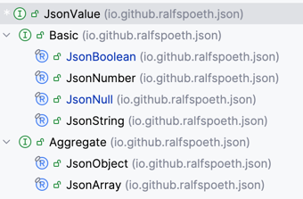

# Greyson - Java JSON IO Library


A modern Java library for parsing JSON into **immutable data structures** 
and serializing them back to text. It features a robust parser, a fluent builder API, 
efficient UTF-8 serialization, and powerful query functions to transform JSON 
elements into any Java objects.

## Goals

*   **Immutable JSON Representation**: Work with JSON data that cannot change after creation, ensuring thread safety and predictable state.
*   **Robust Parsing**: Reliably parse all legal JSON documents and streams.
*   **Fluent Builder API**: Construct complex JSON objects and arrays with ease.
*   **Efficient Serialization**: Quickly serialize JSON elements into UTF-8 documents and streams.

Greyson parses the original version of JSON only with the only relaxation
that ALL values may be root elements, not just objects and arrays. There are 
no options to customize the contents, to be more relaxed or even stricter at the 
parsing level.

## Current Status

THIS ALPHA VERSION OF 1.2 IS CURRENTLY UNDER ACTIVE DEVELOPMENT.

The current version of the library is 1.2.0.
It contains two breaking changes compared to version 1.1.x:
* The common interface has been renamed from `Element` to `JsonValue`
  because that naming pattern seems to be more in line with other libraries.
* `JsonNumber` uses `BigDecimal` instead of `double` for its payload; 
  cf. [numbers](numbers.md) for a detailed discussion.
* `JsonBoolean` and `JsonNull` are implemented as `record`s, no longer as an `enum` or 
  singleton, respectively.
* Conversions from and to `record`s have been removed in an attempt to get rid of deep
  reflection.
* It utilizes `JSpecify` nullness annotations.

Beginning with version 1.2.0, the `Builder`s are the mutable duals of
their immutable `JsonValue` counterparts, such that

    var jo = new JsonObject(...);
    var builder = Builder.objectBuilder(jo);
    assert jo.equals(builder.build());

and most naturally 

    var ja = new JsonArray(...);
    var builder = Builder.arrayBuilder(ja);
    assert ja.equals(builder.build());

plus 

    var jv = Basic.of(...);
    var builder = Builder.valueBuilder(jv);
    assert jv.equals(builder.build());

The conversions from `JsonValue` to `Builder` are recursive in both directions.
A `JsonArray` of `JsonObject`s is turned into a `JsonArrayBuilder` 
with mutable `JsonObjectBuilder` instances in its mutable `ArrayList` data collection.
The `build` method turns it into a fresh, immutable `JsonArray` instance
of `JsonObject`s.

## The Greyson Workflow

The Greyson workflow has been designed around the JSON in-memory object representation
described below:

* The Greyson library parses a JSON document into a `JsonValue` instance.
* User Code uses the _Greyson Query API_ to instantiate target class instances
  for this value.
* User Code transforms an arbitrary class instance 
  (or array or collection of objects) into a `JsonValue`
  using the _Greyson Builder API_.
* The Greyson library serializes this `JsonValue` into a JSON file.


## Why Yet Another JSON Library?

There is nothing wrong with either Jackson or GSON. Both
Jackson and GSON tend to provide some magic twists to convert
a JSON document into an arbitrary class instance and vice versa.
Both libraries support a model similar to the Greyson workflow with
an intermediate representation, and both libraries provide access to 
their token stream parsers. Both provide extensive customization options.
All these features make these libraries quite large. Greyson is intentionally
small both in terms of package size and in terms of classes, methods and more
important: conceptual design. 
Here are some thoughts about [why not GSON or Jackson](whynot.md)]

Greyson is not intended to be the fastest JSON parsing library on the planet,
nor is it. Micro benchmarks and profiling tests show that 
both parsing and writing is much slower than
GSON or Jackson in its current incarnation. These two libraries
use a lot of (sometimes dirty and ugly) tricks to gain maximum performance.
The Greyson library, however,
uses algebraic data types even for the internal intermediate representation
of the parsed data, which lead to a very clean lexer and parser as well as
writer designs -- yet at the expense of degraded performance.
We assume that value class will help Greyson to close the gap to GSON and Jackson
in the future without compromising the current simplicity of the implementation.

## JSON Test Suite

Beginning with version 1.1.25, we've added a number of tests
from the nst [JSON Test Suite](https://github.com/nst/JSONTestSuite). 
This test suite revealed some minor and even larger issues 
parsing especially non-well-formed JSON documents, which have been fixed 
in the 1.1.x branches.

## Getting Started

### Importing The Library

Maven Coordinates

    Group ID: io.github.ralfspoeth
    Artifact ID: json

In your `pom.xml` add
```xml
    <dependency>
        <groupId>io.github.ralfspoeth</groupId>
        <artifactId>json</artifactId>
        <version>1.2.0</version>
    </dependency>
```
or, when using Gradle (Groovy)
```groovy 
    implementation 'io.github.ralfspoeth:json:1.2.0'
```
or, with Gradle (Kotlin), put 
```kotlin
    implementation("io.github.ralfspoeth:json:1.2.0")
```
in your build file.

If you are using JPMS modules with a `module-info.java` file, add

```java    
    module your.module {
    requires io.github.ralfspoeth.greyson;
    // more
}
```
### Basic Usage

The module `io.github.ralfspoeth.greyson` exports three packages that you 
may use in your application:
```java
    import io.github.ralfspoeth.json.*;       // class hierarchy
    import io.github.ralfspoeth.json.io.*;    // reader and writer
    import io.github.ralfspoeth.json.query.*; // Queries and Path API
```
The first package contains the data types (`JsonValue` and its descendants)
and the second contains the `JsonReader` and `JsonWriter` classes.
The last package contains the `Queries`, the `Path` and the `Validation` classes
which make the Query API of Greyson.
This API allows for mapping operations like this:

```java
    Reader r;
    try(var rdr = new JsonReader(r)) { // auto-closeable
        JsonValue elem = rdr.readJsonValue(); 
        // switch over elem
        double dbl = switch(elem) {
            case JsonNumber(double d) -> d;
            null, default -> throw new IllegalArgumentException("...");
        }

        // often, you may easily convert the element into a simple record
        // {"x": 1, "y": 2}
        record MyRecord(int x, int y) {} 
        var rcd =  new MyRecord(
            intValue(members(elem).get("x")), 
            intValue(members(elem).get("y"))
        );
        
        // or you may want to query some leaves in the JSON structure 
        Path.of("[1..3]/a/#x.*y/c").apply(elem).forEach(...);
    }
```
Writing data into a JSON stream works either through the builders
```java
    Writer out;
    JsonObject jo = Aggregate.objectBuilder()
        .named("x", JsonBoolean.TRUE)
        .named("y", Basic.of(5d))
        .build();
    try(var w = JsonWriter.createDefaultWriter(out)) {
        w.write(jo);
    }
```
or through standard conversions from an object of a `Record` subclass
```java
    Writer out;
    record Rec(boolean x, double y) {}
    Rec r = new Rec(true, 5d);
    JsonValue jo = JsonValue.of(r);
    try(var w = JsonWriter.createDefaultWriter(out)) {
        w.write(jo); // {"x": true, "y": "5.0"}
    }
```
The entire API is designed such that it never returns
`null` as an `JsonValue` reference, but is, however, resilient
towards `null` as an argument wherever reasonable.

## JSON

[RFC 7159](https://datatracker.ietf.org/doc/html/rfc7159)
specifies the JSON data interchange format which 
has become the _lingua franca_ for RESTful webservices.
JSON serializes structured data in a human-readable 
text format. It supports four primitive types
(strings, `double` numbers, booleans and `null`) and 
two aggregates types (arrays of primitive or aggregate types
and objects which are basically
maps of names (strings) and values of primitive or aggregate types).

### Example:
```json
    [{
        "name": "Gaius",
        "age": 41,
        "pro": false,
        "publications": ["De bello gallico"]
    }, {
        "name": "Cicero",
        "senator": true,
        "children": null
    }]
```
This text represents an array of two objects; the
outer form reads `[a, b]` where `a` and `b` are the 
objects.
Braces `{` and `}` enclose these two objects
with name-value-pairs separated by commas, like 
`{ nvp1, nvp2, ...}`. 
Each name-value-pair consists of a name of type
string and a value of any other data type mentioned
above. The name-value-pairs make the properties or 
attributes of an object.
The `name` property of the first object is associated
with the string `"Gaius"`, the `pro` attribute 
with the value `false`. The value of the `publications`
attribute is an array of a single string valued
`"De bello gallico"`.

Wikipedia has more on JSON [here](https://en.wikipedia.org/wiki/JSON).

JSON is schema-less, that is, you cannot prescribe the structure
of a JSON document using some kind of schema.
This sets JSON apart from [XML](https://www.w3.org/TR/xml/) which
allows for the specification of document type definitions
([DTDs](https://www.w3.org/TR/xml/#sec-prolog-dtd)) 
or XML schema definitions 
([XSD](https://www.w3.org/TR/xmlschema/)).
XML, once hyped as the next big thing and with numerous 
applications still widely in use, has been surpassed by JSON 
according to
[Google Trends: JSON vs. XML](https://trends.google.de/trends/explore?date=all&q=XML,JSON&hl=EN)

### Remarks

The objects do not expose some notation of a type
or class. Two objects are considered equal if their 
attributes are equal. Arrays may contain any combination
of instances, including both primitive and structured 
types as in `[null, true, false, 1, {"x":5}, [2, 3, 4]]`

# Modeling the Data

## Differentiating between Aggregate and Basic Types

In lieu with the JSON specification which differentiates
between primitive and structured types, we differentiate
between basic and aggregate types like so:
```java
    public sealed interface JsonValue permits Basic, Aggregate {...}
    public sealed interface Basic extends JsonValue permits
        JsonBoolean, JsonNull, JsonNumber, JsonString {}
    public sealed interace Aggregate extends JsonValue permits
        JsonArray, JsonObject {...}
```
Naming primitive types "basic" and structured types "aggregates" has
been a deliberate decision since the term primitive would collide with
the notion of primitive types in the Java language.

## Basic Types

The implementation of the four basic types is straightforward as `record`s
of the respective JSON basic types:
```java
    record JsonBoolean(boolean boolVal) {}
    record JsonNumber(BigDecimal numVal) {}
    record JsonNull() {}
    record JsonString(String value){}
```
Both `BigDecimal` and `String` record components will never be `null`.
The `Basic` interface defines the generic method `T value();` which 
are implemented by all four basic types.

## Aggregate Types

### Modelling `Array` as `record` of an Immutable `List`

As with strings we need to wrap the array in some
container - a final class or a record - plus
we want to make sure the contents is immutable:
```java
    public record JsonArray(List<JsonValue> elements) implements JsonValue {
        public JsonArray {
            elements = List.copyOf(elements); // defensive copy
        }
    }
```
The canonical constructor is overridden such that
it uses a copy of the list provided;
that method is clever enough _not_ to copy the list
parameter if it can be sure that that parameter
is already an immutable instance &ndash; most notably if
it has been instantiated using `List.of(...)`.
This method also makes sure no actual `null` instance
is passed in within the list of elements.
(`JsonNull`s are acceptable of course.)

### Modelling `Object` as `record` of an Immutable `Map`

The same is true for `JsonObject`s. We model the properties
or attributes or members as a map of `String`s (not `JsonString`s since
this wouldn't add any value and is much easier to use by clients)
to `JsonValue`s:
```
    public record JsonObject(Map<String, JsonValue> members) implements JsonValue {
        public JsonObject {
            members = Map.copyOf(members); // defensive copy
        }
    }
```
`Map.copyOf` provides a copy but returns the original map
when that is already immutable, especially when instantiated using
`Map.of(...)`.

Since both aggregate types `JsonObject` and `JsonArray` are
shallowly immutable (or unmodifiable) and all basic types  
are immutable, the aggregate types are effectively immutable as well.
This makes instance of the entire hierarchy immutable.

## Aggregates are Functions

Both aggregate types serve as functions: `JsonObject`s are
functions of `String`s and `JsonArray`s are functions of
an `int` index:
```java
    Map<String, JsonValue> members; // given
    var obj = new JsonObject(members);
    Function<String, JsonValue> fun = obj; // legal
```
and
```java
    List<JsonValue> lst; // given
    var arr = new JsonArray(lst);
    IntFunction<JsonValue> ifun = arr; // legal
```
That said, the hierarchy of the data classes is this:



## All `JsonValue`s are `Predicate`s

The query API uses structural patterns for validating JSON data
before mapping it to some target Java object.
The fact that every `JsonValue` already _is_ a pattern comes in handy 
for this purpose. Consider this array of numbers
```json
    [1, 2, 2, 3]
```
which is parsed into
```java
    var a = new JsonArray(1, 2, 2, 3);
```
This `a` can now easily be filtered like
```java
    assert 2 == a.stream().filter(Basic.of(2)).count();
```
# Builders

The [Builder pattern](https://en.wikipedia.org/wiki/Builder_pattern)
allows for a piecemeal construction of
immutable data and works like this:
```java
    var immutable = new Builder(...).add(...).add(...).build();
```
It does not make much sense to provide builders for the basic data
types; yet very much so for the aggregate types.
This is another reason why we introduced the distinction between the two.

The `Builder` interface has been implemented as an inner interface
class of the `Aggregate` interface with two implementations:
```java
    public sealed interface Aggregate permits JsonArray, JsonObject {
        sealed interface Builder<T extends Aggregate> {
            T build();
            // ...
        }
        final class ArrayBuilder implements Builder<JsonArray>{...}
        final class ObjectBuilder implements Builder<JsonObject>{...}
        // ...
    }
```
Since the implementing classes reside within the same compilation unit
as the `Builder` there is no need for the `permits` clause.

## ArrayBuilder

The array builder simply provides a method that adds an `JsonValue`:
```java
    final class ArrayBuilder implements Builder<JsonArray> {
        item(JsonValue e) {
            // add to mutable list
        }
        JsonArray build() {
            return new JsonArray(List.of(mutableList));
        }
    }
```
## ObjectBuilder

The object builder is not so different:
```java
    final class ObjectBuilder implements Builder<JsonObject> {
        named(String name, JsonValue e) {
            // put into mutable map
        }
        JsonObject build() {
            return new JsonObject(Map.of(mutableMap));
        }
    }
```
Both builders are instantiable through static methods in the 
`JsonValue` interface exclusively:

    JsonObjectBuilder objectBuilder();
    JsonArrayBuilder arrayBuilder();

The implementing classes both need to be public because they provide
different methods for adding intermediate data;
`JsonArray` provides an `item(JsonValue)` method and
`JsonObject` a `named(String, JsonValue)` method in order to
add data their internal structures.

# IO: Reading and Writing JSON Data

## From JSON

The parser implementation named `JsonReader` in package
`io.github.ralfspoeth.json.io` implements the `AutoCloseable` interface and is
meant to be used in try-with-resources statements.
Given 
```java
    Reader src = new StringReader("""
        {"make": "BMW", "year": 1971}"""
    );
```
then
```java 
    try(var rdr = new JsonReader(src)) {
        return rdr.readElement();
    }
```
produces `new JsonObject(Map.of("make", new JsonString("BMW"), "year", Basic.of(1971)))`.
When we want to read the JSON into a Java object of some type, say `record Car(String make, int year) {}`
we'd write:
```java 
    import static io.github.ralfspoeth.json.query.Queries.*;
    // ... later
    try(var rdr = new JsonReader(src)) {
        return rdr.read() // Optional<JsonValue>
          .map(jv -> new Car(
              stringValue(members(jv).get("make")),
              intValue(members(jv).get("year"))
          )) // Optional<Car>
          .orElseThrow(); // Car
    }
```
Consider now that we want to reject JSON data that is not - at least - a
JSON object:
```java 
    try(var rdr = new JsonReader(src)) {
        return rdr.read() // Optional<JsonValue>
          .filter(jv -> jv instanceof JsonObject)
        // ...
    }
```
or, with the help of the `Validation` class, we might enforce a structure
and a mandatory set of keys:
```java 
    import static io.github.ralfspoeth.json.query.Validation.*;
```

```java
    try(var rdr = new JsonReader(src)){
        return rdr.read() // Optional<JsonValue>
          .filter(is(JsonObject.class)
            .and(requiredKeys("make", "year"))
            .and(matches(Map.of("make", is(JsonString.class)), "year", is(JsonNumber.class)")))
            // ...
    }
```
The `Validation` class even helps us build and reuse predicates as well as
provide useful explanations:

```java 
    var predicate = is(JsonObject.class).and(...);
    try(rdr = new JsonReader(src)) {
        return rdr.read() // Optional<JsonValue>
            .map(jv -> check(jv, predicate)) // Optional<Result>
            .map(result -> explainIfFailed(result)) // Optional<Result>
            .map(result -> valueOrThrow(result)) // Optional<JsonValue>
            .map(jv -> new Car(<see above>)) // Optional<Car>
            .orElseThrow(); // Car
    }
```


## To JSON

The `JsonWriter` class is instantiated with its 
default behavior of indenting the members of JSON 
objects by four characters and putting each member in 
a separate line. Arrays are printed interspersed 
by commas and a white space but in a single line.

The usage is similar to that of the `JsonReader` with
the exception that it uses a single factory method currently
but not constructor:

    JsonValue object = ... 
    Writer w = ... 
    try(var wrt = JsonWriter.createDefaultWriter(w)){
        wrt.write(object);
    }

The `JsonWriter` provides the static method
`minimize` which removes whitespace safely from 
a given input stream.

# Querying Data

The package `query` provides simple utilities
for querying data based on some root element.

## The `Path` Utility

The `Path` class is inspired by the [XPath](https://www.w3.org/TR/xpath/)
specification yet lacks almost all of its features;
it's currently just a toy.

### Basic Usage

A `Path` instance is instantiated using the factory
method `Path::of` like so:

    var path = Path.of("a/b/c");

The path expression is split using the `/` character.
Given the statement above, we obtain the equivalent of

    var path = Path.of("c", Path.of("b", Path.of("a")));

where the second parameter is the parent path.
We then use `Path::evaluate` which returns a stream
of `JsonValue`s. Consider this root object `root`

    {
        "a": {
            "b": {
                "c": true
            }
        }
    }

then
    
    assert JsonBoolean.TRUE==path.evaluate(root).findFirst().get();

will not throw an `AssertionError`.


### Syntax

The syntax for the patterns is
* `a..b` where `a` and `b` are integers; a range pattern applicable to arrays;
* `#regex` where `regex` is a regular expression filtering attributes of objects;
* `name` where `name` is just the member name of the root object.

### Examples

Given `[2, 3, 5, 7, 11]` then `Path.of("0..2")` yields
the stream of the first two array elements `2` and `3`.

Given `{"a0":true,"a1":false}` then `Path.of("#a.")`
yields the stream of `true` and `false`.

Given `{"a":{"b":5}}` then `Path.of("a/b")` yields 
the stream of `5d`.

## The `Queries` and `Path`s

The package `io.github.ralfspoeth.json.query` 
contains the utility class `Queries`,
which converts `JsonValue`s into primitive types `int`, `long`, `double` or 
`boolean` and to `String` or a given `Enum` type, and `Path`, which
builds on `Queries` and combines the navigation to elements in a 
JSON structure and the conversions provided by `Queries`.

All functions take any `JsonValue` type as an argument and may
throw `IllegalArgumentException` for the sake of simplicity.
The functions respects 
that many JSON authors put all values into double-quotes, even `null`, `true`, and `false`
as well as numbers. These values are parsed into `JsonString` instance;
their contains is converted into numbers, boolean values and `null` if possible 
as well.

### Take the Clutter Away

The JSON structure _done right_ as we think gives us the basis for further processing data
utilizing the pattern matching features of Java. However, there are still situations
where a JSON structure is replicated with each element mapped onto its natural counterpart,
that is

* `null` to `null`s,
* `true` and `false` to `boolean`s,
* `JsonDouble` to `double`s,
* `JsonString` to `String`s,
* `JsonObject` to immutable `Map<String, ?>`s, and 
* `JsonArray` to immutable `List<?>`s.

So, a nested JSON structure like

    {"a": null, "b": true, "c": {
        "x": [1, 2, null, true], "y": false, "z": null
    }}

is converted by `Queries.value` into 

    Map.of( // "a" to null binding is cut out, cf. Map#of
        "b", Boolean.TRUE, // note the primitive wrapper
        "c", Map.of(
            "x", List.of(1, 2, true), // null element is cut out 
            "y", Boolean.FALSE // "z" to null binding is left out
        )
    )

Things to note: maps and lists accept `null` values in principle,
yet the factory methods `List.of` and `Map.of` do not accept `null` values
or `null` bindings; so, `JsonNull` instances are filtered out of aggregates.
That said, always consider the maps and lists regardless of the depth of the structure immutable.

### Numerical Conversions

The methods `intValue`, `longValue` and `doubleValue` utilize the 
`parse<Type>` methods of the respective `Integer`, `Long` and `Double` 
classes for `JsonString`s, and standard conversion from `double` to `int` and `long`
for `JsonNumber`s. `JsonBoolean` are converted to 1 and 0 for `TRUE` and `FALSE`, 
respectively.

These functions are provided with and without a default value as their second parameter.
`intValue(JsonValue elem, int def)` accepts `null` elements and return the `def`ault instead;
the method fails with `IllegalArgumentException` for `Aggregate`s. The companion methods work likewise.

There is no direct support for `byte`, `char`, `short` and `float` 
which is very much in line with the choices of Java's functions and stream design.

### String Conversion

The `stringValue` conversion uses natural conversions for all
`Basic` types, and the `toString` methods applied on the contained 
`list`s and `map`s of the `Aggregate` types.

### Boolean Conversion

The `booleanValue` conversion does the obvious conversions for `JsonBoolean`
and `JsonString`.

### Enum Conversion

The `enumValue...` methods takes two arguments: a class declared with the `enum` 
keyword, and the `JsonValue` which must be of type `JsonString`. 
While `enumValue` uses the `Enum::valueOf` method, the `enumValueIgnoreCase`
converts the value and all the constants' names defined in the enum class 
to uppercase strings before selecting the enum constant.

### JsonArray to Primitive Array

A `JsonArray` can be converted into an array of primitives; 
all elements are converted using `Queries.{int|long|double|...}Array(JsonValue)`.


# Usage in Clojure

Clojure uses maps to aggregate data and prefers keywords as keys in these maps.
Here is a link to a video from Rich Hickey:
[Just use maps](https://youtu.be/aSEQfqNYNAc?si=tkFy1CMS8fWN7bP-)

In order to use this Java library, include this in your `deps.edn` file:

    {:deps {
        io.github.ralfspoeth/json {:mvn/version "1.2.0"}
        }}

Import the `JsonValue` and IO classes into your namespace like this

    (ns your.name.space
        (:import 
            (io.github.ralfspoeth.json JsonValue Basic JsonNull JsonArray JsonObject)
            (java.io Reader)
            (io.github.ralfspoeth.json.io JsonReader))
        (:require [clojure.java.io :as io]))


Use this function in order to read JSON data from some
`java.io.Reader`

    (defn read-elem [^Reader rdr]
        (with-open [jsrd (JsonReader. rdr)]
        (.readJsonValue jsrd)))

and then to turn the resulting `JsonValue` into
a clojure map

    (defn map-json ([^JsonValue elem]
        (cond
          (instance? JsonNull elem) nil,             ; special case JsonNull
          (instance? Basic elem) (.value elem)       ; basic types
          (instance? JsonArray elem) (mapv map-json (.elements elem)) ; map into vector
          (instance? JsonObject elem) (into {} (map  ; map into map  
            (fn [[k, v]] [(keyword k) (map-json v)]) ; map k-v pair to keyword and json value 
            (.members ^JsonObject elem)))))          ; each member of the JSON object


